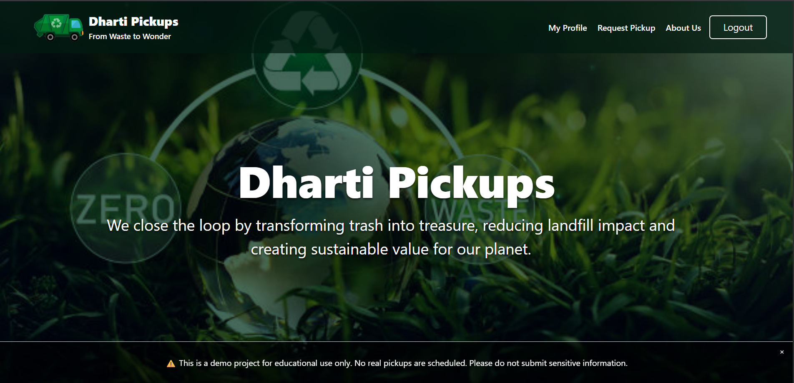
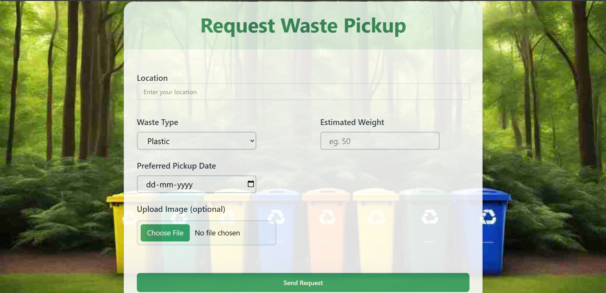
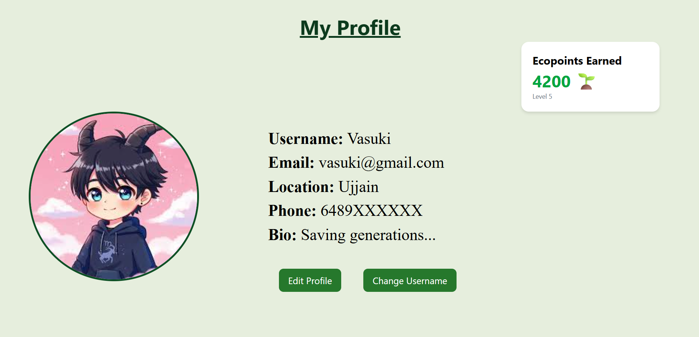
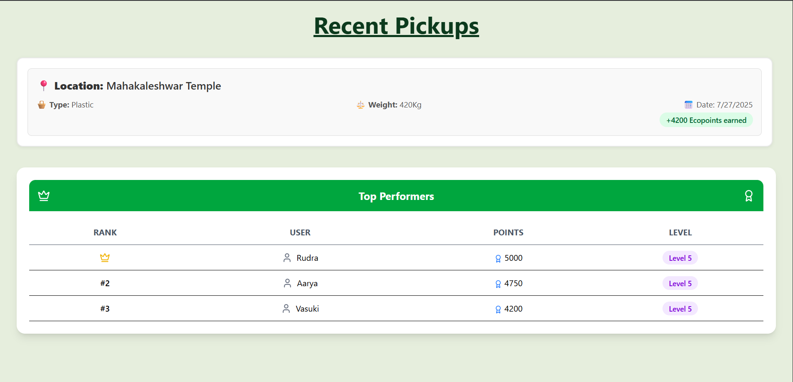

# 🌱 Dharti Pickups

A sustainability-focused MERN stack web app that allows users to request waste pickups, track their ecoPoints, and compete on a leaderboard.

---

## 🚀 Features

- ♻️ Request waste pickups with type, weight, and image
- 🔐 User authentication (login/signup)
- 📊 Leaderboard based on ecoPoints (10 × weight)
- 👤 Profile management with edit options
- ☁️ Cloud image upload via Cloudinary
- 📱 Responsive design (mobile/tablet ready)

---

## 🛠️ Tech Stack

**Frontend:** React, Axios, TailwindCSS, Vite  
**Backend:** Node.js, Express, MongoDB, JWT, Cookie Auth  
**Image Upload:** Cloudinary  
**Deployment:** Vercel (frontend), Render (backend)

---

## 🖼️ Screenshots

### Homepage

### Request Pickup

### Profile Page

### Leaderboard

---

<!-- ## 📽️ Demo Video

--- -->

## 🌐 Live Demo

**Frontend:** [Live on Vercel](https://project-dharti-pickups-mpu6.vercel.app)  
**Backend:** [Live on Render](https://project-dharti-pickups.onrender.com)

---

## 📂 Folder Structure

## 📧 Contact

Made with ❤️ by Charu Tiwari
